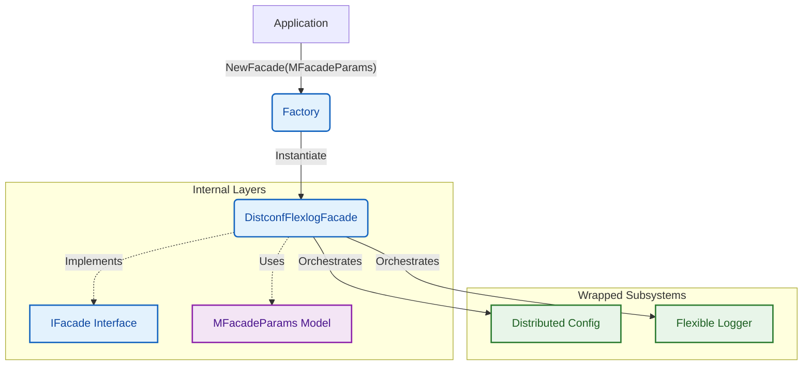

# Architecture: Distconf-Flexlog Facade

This document describes the architectural design of the `distconf-flexlog` orchestrator, which provides a unified interface for configuration and logging.

## Architectural Philosophy

The project adheres to the **Clean Architecture** and **Facade Pattern** principles. It serves as a glue layer that aligns two independent libraries into a single, cohesive developer experience.

### 1. The SystemFacade Pattern
The core component is the `DistconfFlexlogFacade`. It is the **only** component that coordinates between `distributed-config` and `flexible-logger`. 

## Layered Structure (src/)

The codebase is organized into four distinct layers to ensure maximum decoupling and testability:

-   **`src/models/`**: Contains pure data structures.
    -   `MFacadeParams`: The single configuration object used to bootstrap both systems.
-   **`src/interfaces/`**: Defines the decoupling boundaries.
    -   `IFacade`: An interface that embeds `interfaces.Logger` and provides access to the shared `Config`.
-   **`src/facade/`**: The implementation of the orchestrator.
    -   `DistconfFlexlogFacade`: Manages the lifecycle of both configuration and logging instances.
-   **`src/factory/`**: The dependency injection layer.
    -   `facade_factory.go`: Provides the `NewFacade` function, hiding the complexity of sub-system alignment.

## System Alignment & Integration

The facade performs several "bridge" operations to ensure the two libraries work together seamlessly:

### 1. Capability Mapping
`flexible-logger` requires network addresses for its remote sinks. The facade automatically extracts these from the `distributed-config` capabilities:
-   `config.Capabilities.LogServer` ➔ Maps to Logger Network Sink.
*   `config.Capabilities.NotifServer` ➔ Maps to Logger Notifier.

### 2. Dynamic Initialization
The facade handles the "chicken-and-egg" problem:
1.  It initializes **Distributed Config** first to obtain current environment settings.
2.  It then uses those settings to initialize the **Flexible Logger** profiles (Standard, HighPerf, etc.).
3.  Finally, it applies the user-requested `LogLevel` via the `SetLevel` interface method.

## Safety & Performance

-   **Error Handling**: The facade ensures that configuration load failures are logged via the logger's fallback mechanisms before the main engine is online.
-   **Concurrency**: Access to the underlying `Config` is thread-safe as per the `distributed-config` implementation, and the `LogEngine` maintains its lock-free or mutex profiles as requested by the user.
