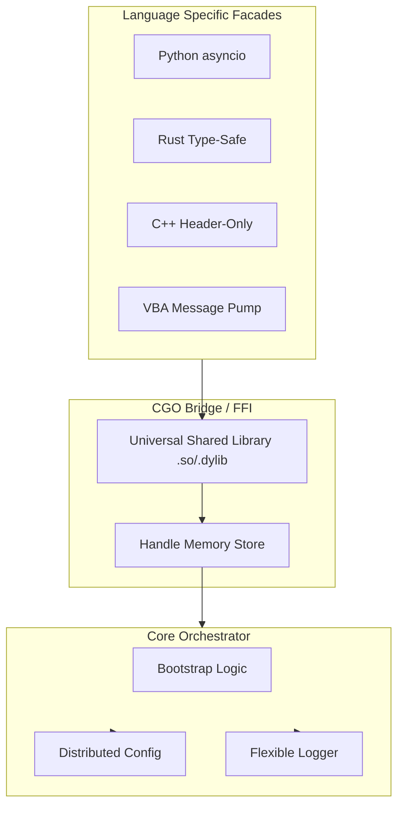

# Architecture: Universal Logger

This document describes the architectural design of the `universal-logger` project, which provides a unified, cross-platform interface for configuration and logging via a shared Go-based core.

## Architectural Philosophy

The project adheres to a **Layered Facade** pattern. At its heart is a Go-native implementation that orchestrates `distributed-config` and `flexible-logger`. This core is exposed to other languages via a high-performance CGO bridge.

## Key Architectural Components

### 1. The Go Core (`src/`)
The Go core is responsible for the actual "heavy lifting":
- **Bootstrap**: Aligns the configuration secrets and discovery data with the logging engine's requirements.
- **Session Management**: Tracks multiple logger instances using a thread-safe `uintptr -> Session` map.
- **Dynamic Leveling**: Synchronizes log level changes across all active sinks.

### 2. The CGO Bridge (`src/cgo_bridge/`)
The Bridge serves as the "Universal Translator":
- **FFI Stability**: Exposes a stable C ABI (Application Binary Interface).
- **Callback Dispatching**: Handles the transition from Go goroutines to language-specific threads (e.g., acquiring the Python GIL).
- **String/Memory Safety**: Manages memory allocation/deallocation across the boundary (using `C.CString` and `C.free`).

### 3. Language Facades
Each language library matches the native idioms of its environment:
- **Python**: Uses `asyncio.Queue` and background threads to provide a non-blocking experience.
- **Rust**: Provides `Send`/`Sync` wrappers and safe pointer management.
- **C++**: Follows RAII (Resource Acquisition Is Initialization) for automatic handle cleanup.
- **VBA**: Implements a Windows Message Pump to bridge multi-threaded Go callbacks into single-threaded Excel/Access environments.

## Data Flow: Configuration Updates

1. **Go Core**: Detects a remote configuration change.
2. **CGO Bridge**: Serializes the update to JSON.
3. **FFI Boundary**: Triggers the C function pointer registered by the client.
4. **Python Facade**: (Example) Receives the callback in a background thread, pushes to an `asyncio.Queue`.
5. **Application**: Receives the update via `async for update in logger.on_config_update()`.

## Safety and Concurrency

- **Thread Safety**: The Go core uses `sync.Mutex` to protect the facade store. Each logging operation is non-blocking (async) at the core level.
- **Resource Lifecycle**: Every language implementation is required to call `close()` or implement a finalizer (`__del__`, `Drop`, destructor) to ensure Go-side memory is cleaned up.
- **FFI Overhead**: Minimized by passing handles (integers) instead of complex objects across the boundary.
