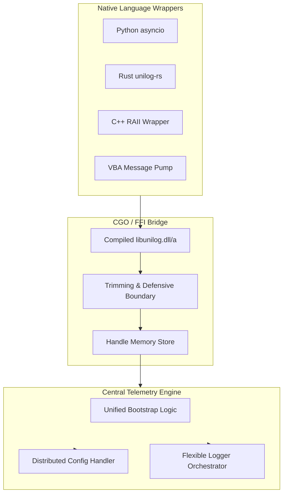

# Architecture: Universal Logger

This document describes the architectural design of the `universal-logger` project, which provides a unified, cross-platform interface for configuration and logging via a shared Go-based core.

## Architectural Philosophy

The project adheres to a **Layered Facade** pattern. At its heart is a Go-native implementation that orchestrates `distributed-config` and `flexible-logger`. This core is exposed to other languages as a **Shared Dynamic Library** (`.dll`, `.so`, `.dylib`).

```mermaid
flowchart TD
    subgraph Language_Facades [Native Language Wrappers]
        Py[Python asyncio]
        Rs[Rust unilog-rs]
        Cpp[C++ RAII Wrapper]
        VBA[VBA Message Pump]
    end

    subgraph Bridge_Layer [CGO / FFI Bridge]
        SharedLib[Compiled libunilog.dll/a]
        SafeFFI[Trimming & Defensive Boundary]
        HandleMap[Handle Memory Store]
    end

    subgraph Go_Core [Central Telemetry Engine]
        Bootstrap[Unified Bootstrap Logic]
        DistConfig[Distributed Config Handler]
        FlexLogger[Flexible Logger Orchestrator]
    end

    Language_Facades --> SharedLib
    SharedLib --> SafeFFI
    SafeFFI --> HandleMap
    HandleMap --> Go_Core
    Go_Core --> DistConfig
    Go_Core --> FlexLogger
```

## Key Architectural Components

### 1. The Go Core Engine (`src/`)
Since the 2026 modernization, the core acts as the single source of truth for telemetry:
- **Unified Bootstrap**: Aligns configuration secrets and discovery data with the logging engine. It supports **Dependency Injection**, allowing a single `distributed-config.Config` instance to be shared organizations-wide.
- **Defensive Marshaling**: Includes YAML-tag protection (`yaml:"-"`) on internal fields to prevent runtime panics during configuration loading.
- **Session Management**: Tracks multiple logger instances using a thread-safe `uintptr -> Session` map.

### 2. The FFI Boundary (`src/cgo_bridge/`)
The bridge ensures stability across memory frontiers:
- **Input Sanitization**: Re-implemented in 2026 to automatically trim whitespace and NULL bytes from incoming C strings, preventing profile matching failures.
- **FFI Stability**: Exposes a stable C ABI.
- **Callback Dispatching**: Handles the transition from Go goroutines to language-specific threads (e.g., acquiring the Python GIL or using `PostMessageA` for VBA).

### 3. Native Facades
Each language provides a wrapper that feels native to its ecosystem:
- **Python**: Uses `ctypes` and `asyncio` for non-blocking telemetry.
- **Rust**: Uses a dedicated `unilog-rs` crate with `build.rs` for automated linking to the `.a` import library.
- **C++**: Uses a thread-safe RAII header for automatic session cleanup.
- **VBA**: Uses a **Windows Message-Based Proxy** via a hidden `HWND_MESSAGE` window to safely bridge multi-threaded Go callbacks into Excel's single-threaded environment.

## Concurrency and Performance

- **Non-Blocking Architecture**: Log dispatching is asynchronous at the core level; FFI calls return immediately while Go handles the delivery.
- **FFI Efficiency**: Telemetry is managed via integer handles (Session IDs) to minimize complex data serialization across the boundary.
- **Thread Safety**: All state management in the Go core is protected by `sync.Mutex`, making the shared library safe for use in multi-threaded environments (Rust/Python/Go).

## Resource Lifecycle

Every native facade is responsible for its own cleanup:
- **Python**: `UniLog.close()` and `__del__`.
- **Rust**: Automatic `UniLog::drop()` implementation.
- **C++**: RAII destructor.
- **VBA**: Manual `UniLog_Close` or `StopConfigWatcher`.
