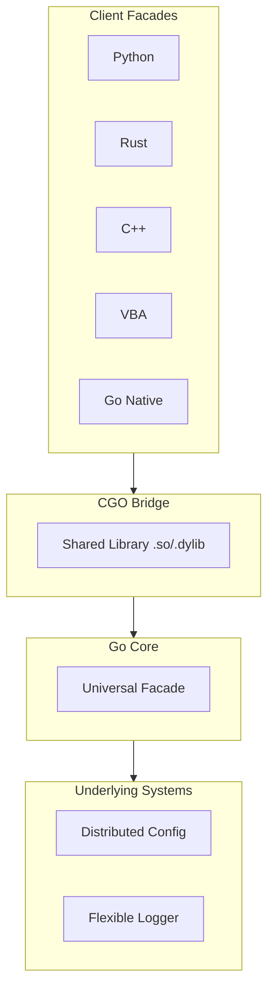

# Universal Logger

A unified, high-performance, cross-platform logging and configuration facade. Universal Logger provides a single, consistent API across multiple languages (Go, Python, Rust, C++, VBA) by orchestrating [Distributed-Config](https://github.com/Bastien-Antigravity/distributed-config) and [Flexible-Logger](https://github.com/Bastien-Antigravity/flexible-logger) via a high-performance CGO bridge.

## 🏗️ Architecture

Universal Logger acts as a "Universal Adapter," allowing various languages to leverage a shared Go-based core for configuration management and high-throughput logging.

## 🚀 Key Features

- **Multi-Language Support**: Identical API signatures for Go, Python, Rust, C++, and VBA.
- **Asynchronous Logging**: Non-blocking log dispatching across all supported languages.
- **Dynamic Configuration**: Real-time configuration updates with language-native callback support (e.g., `async for` in Python).
- **High Performance**: Leverages Go's concurrency model and low-latency CGO FFI.
- **Lifecycle Management**: Robust resource handling with context managers and automatic cleanup.

## 📊 Operational Profiles

The logger supports various synergistic profiles out of the box:

| Profile | Config | Logger | Primary Use Case |
| :--- | :--- | :--- | :--- |
| **Local Dev** | `standalone` | `devel` | Rapid local iteration with text logs. |
| **Production** | `production` | `standard` | Full remote orchestration and multi-sink logging. |
| **High Load** | `production` | `high_perf` | Low-latency async network logging (UDP/Capnp). |
| **Testing** | `test` | `minimal` | Optimized for CI/CD environments. |
| **Monitor** | `preprod` | `notif_logger` | Notification-focused with remote monitoring. |

## 🛠️ Project Structure

- `src/`: Go core and CGO bridge implementation.
- `python/`: Python facade with `asyncio` support.
- `rust/`: Rust safety wrappers and Cargo integration.
- `cpp/`: C++ header-only like facade.
- `vba/`: Excel/Access integration via Windows Message Pump.
- `libunilog/`: Compiled shared libraries and C headers.

## 📜 Maintenance

This project centralizes operational alignment:
- **Field Mapping**: Automatically links `Distributed-Config` capabilities to `Flexible-Logger` requirements.
- **Unified Leveling**: Standardizes log level parsing and dynamic updates across all FFI boundaries.
