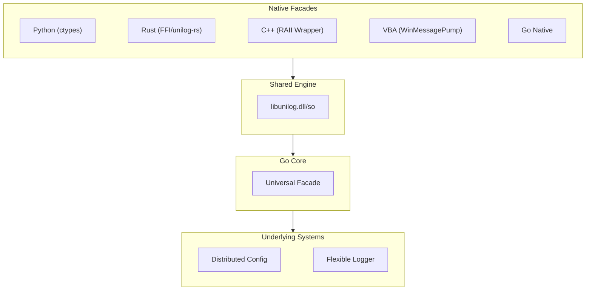

# Universal Logger

A unified, high-performance, cross-platform logging and configuration facade. Universal Logger provides a single, consistent API across multiple languages (Go, Python, Rust, C++, VBA) by orchestrating [Distributed-Config](https://github.com/Bastien-Antigravity/distributed-config) and [Flexible-Logger](https://github.com/Bastien-Antigravity/flexible-logger) via a high-performance CGO bridge.

## 🏗️ Architecture

Universal Logger acts as a "Universal Adapter." Since modernization 2026, it centers on a **Compiled Go Core** distributed as a shared library (`.dll`, `.so`, `.dylib`), ensuring 100% telemetry parity across all technological stacks.


```mermaid
flowchart TD
    subgraph Client_Layers [Native Facades]
        Py["Python (ctypes)"] ~~~ Rs["Rust (FFI/unilog-rs)"] ~~~ Cpp["C++ (RAII Wrapper)"] ~~~ VBA["VBA (WinMessagePump)"] ~~~ Go["Go Native"]
    end

    subgraph Bridge_Layer [Shared Engine]
        DLL["libunilog.dll/so"]
    end

    subgraph Core_Layer [Go Core]
        Facade["Universal Facade"]
    end

    subgraph Components [Underlying Systems]
        Config["Distributed Config"] ~~~ Logger["Flexible Logger"]
    end

    Client_Layers --> Bridge_Layer
    Bridge_Layer --> Core_Layer
    Core_Layer --> Components
```

## 🚀 Modernization 2026 (Phase 1 & 2)

The project has transitioned to a **Shared Library First** approach:
- **Phase 1 (Successful)**: Modernized Python `microservice-toolbox` with a robust `UniLogger` wrapper.
- **Phase 2 (Successful)**: Modernized Rust `microservice-toolbox` with the `unilog-rs` crate and automated DLL linking.
- **Unified Telemetry**: ALL languages now share the same Go-based configuration loading, environment resolution, and asynchronous logging sinks.

## 🚀 Key Features

- **Multi-Language Parity**: Identical behavior and structured log formats for Go, Python, Rust, C++, and VBA.
- **DLL-Based Core**: One library to rule them all—fixes applied to the Go core benefit all languages instantly.
- **Asynchronous Logging**: Non-blocking log dispatching across all supported languages.
- **Dynamic Configuration**: Real-time configuration updates with language-native callback support.
- **State Inspection**: `GetLevel()` accessor across all facades for real-time verification of active log levels.
- **Lifecycle Management**: Robust resource handling with context managers and automatic cleanup.

## 📊 Operational Profiles

Universal Logger uses "prescribed strategies" to ensure the right balance of reliability and performance for every use case.

| Profile | Config | Logger | Connection Strategy | Mode | Use Case |
| :--- | :--- | :--- | :--- | :--- | :--- |
| **Local Dev** | `standalone` | `devel` | Standard | Blocking | Rapid local iteration. |
| **Production** | `production` | `standard` | Standard | Non-Blocking | General multi-sink logging. |
| **Audit** | `production` | `audit` | **Critical** | **Indefinite** | Financial/Compliance (No loss). |
| **Cloud Native** | `production` | `cloud` | Standard | Non-Blocking | Microservices / K8s. |
| **High Load** | `production` | `high_perf` | **Performance** | Non-Blocking | Low-latency telemetry (UDP). |
| **Testing** | `test` | `minimal` | Standard | Blocking | CI/CD environments. |
| **Monitor** | `staging` | `notif_logger` | Standard | Non-Blocking | Remote health monitoring. |

### 🛡️ Reliability & Connection Modes
Starting in **v1.1.7**, connection management is profile-driven:
- **Blocking**: Wait for a successful connection before starting the service (standard for dev/test).
- **Non-Blocking**: Start the application immediately; the logger connects in the background.
- **Indefinite**: Used by the `Audit` profile. It will retry forever with exponential backoff and jitter, ensuring no data is lost even during long outages.

## 🛠️ Project Structure

- `src/`: Go core and CGO bridge implementation.
- `unilog/`: Consolidated wrapper and library directory:
  - `unilog/libunilog/`: Compiled shared libraries (`libunilog.dylib`, `libunilog.so`, `libunilog.h`).
  - `unilog/python/`: Python facade with `UniLogger` wrapper.
  - `unilog/rust/`: Rust `unilog-rs` crate and FFI integration.
  - `unilog/vba/`: Excel/Access integration via Windows Message Pump.
  - `unilog/cpp/`: C++ RAII wrapper header.

## 🚀 Quick Start (Shared Library)

To use the logger in any language, ensure `libunilog.dll` is in your `PATH` or application directory.

```go
import (
	unilog "github.com/Bastien-Antigravity/universal-logger/src/bootstrap"
)

// Go Native Bootstrap
cfg, logger := unilog.Init("my-service", "standalone", "standard", "INFO", false, nil)
```

## 📜 Maintenance

This project centralizes operational alignment:
- **One Engine**: All bug fixes in `Distributed-Config` or `Flexible-Logger` are encapsulated in the DLL.
- **Standardized Leveling**: Log level parsing and dynamic updates are consistent across all FFI boundaries.
- **Field Mapping**: Automatically links `Distributed-Config` capabilities to `Flexible-Logger` requirements.
