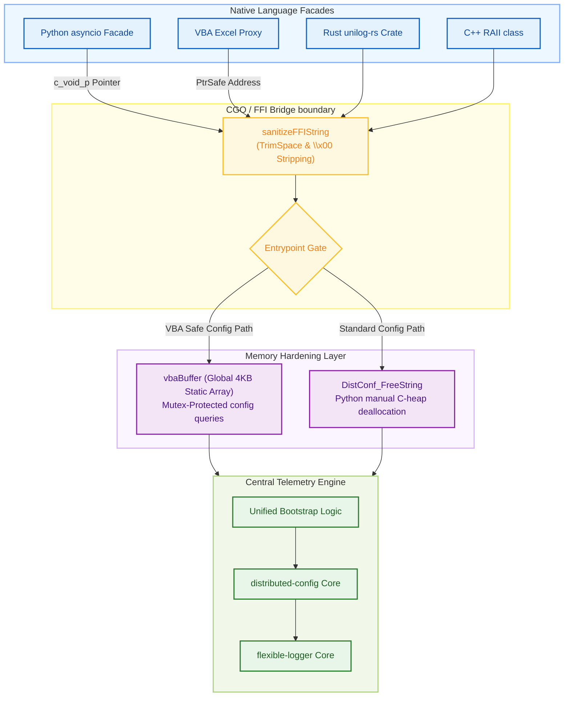

# Architecture Overview: universal-logger

This document provides the definitive architectural design, layered facade topologies, FFI boundary specifications, and thread-safe resource lifecycles of the `universal-logger` repository.

---

## 🏗️ Architectural Philosophy & Layered Facade

The `universal-logger` adheres to a strict **Layered Facade** architectural pattern. At its core is a Go-native central telemetry engine that consolidates connection management, resilience retry pipelines, and high-throughput serialization. This core is compiled into a single shared dynamic library (`.dll`, `.so`, `.dylib`) and exposed via a stable, zero-allocation C ABI.

Native language facades wrap this raw boundary, providing idiomatic APIs tailored for Python, Rust, C++, and VBA without re-implementing transport and aggregation complexity in each runtime.



---

## 🛠️ Key Architectural Components

### 1. Compiled Go Core Engine (`src/`)
The central engine orchestrates active telemetry and configuration configurations:
*   **Unified Bootstrap**: Aligns discovery secrets, environment parameters, and profile parsing. It implements standard **Dependency Injection**, allowing a single `distributed-config` instance to be shared across logging contexts.
*   **Defensive Marshaling**: Implements strict YAML tags (`yaml:"-"`) on internal telemetry channels to guarantee that file loading does not trigger runtime thread panics.
*   **Asynchronous Queues**: Decouples active processes from logging I/O. Messages are pushed to lock-free memory rings, serialized into binary payloads, and streamed in the background, keeping the caller thread fully non-blocking.

### 2. FFI Boundary & Input Sanitizer (`sanitizeFFIString`)
CGO serves as the gatekeeper between native system runtimes and the Go runtime:
*   **Whitespace Trimming**: Automatically strips leading/trailing spaces, tabs, and carriage returns from incoming FFI string buffers.
*   **Null-Byte Stripping**: Truncates trailing or embedded null terminators (`\x00`). This ensures that string comparisons in the Go core match configuration profiles perfectly and prevents buffer misalignments or dynamic memory pointer truncations.

### 3. Native Language Facades
Each wrapper provides client features that align perfectly with runtime expectations:
*   **Python**: Integrates `ctypes` bindings with native `asyncio` loop callbacks, routing live configuration updates via registered `async for` listener loops.
*   **Rust**: Bundled in `unilog-rs` which utilizes a custom `build.rs` script to handle library discovery and link C ABI functions at compile time.
*   **C++**: Implements lightweight RAII wrappers that manage dynamic logger contexts.
*   **VBA / Excel**: Employs a **Windows Message-Based Proxy** via a hidden `HWND_MESSAGE` message window to translate multi-threaded Go callbacks safely into Excel's single-threaded, thread-local memory space.

---

## 🔒 Concurrency, Thread Safety & Performance

*   **Serialized State Gate**: All dynamic session mappings (`uintptr` -> `Session`) and settings updates within the Go core are serialized via an internal `sync.Mutex`.
*   **Zero-Serialization Handle Routing**: Telemetry invocations routing across the CGO boundary are passed as lightweight integer handles (Session IDs) to prevent expensive data marshalling or heap copies between languages.
*   **Non-Blocking Delivery**: Calls to log methods return immediately. Payloads are placed on background ring buffers for network dispatching, ensuring that logging calls do not block the application's critical execution paths.

---

## ♻️ Resource Lifecycle & Memory Hardening

Dynamic memory boundaries across languages are highly vulnerable to garbage collection desynchronizations and heap leaks. The repository enforces strict memory cleanup models:

### 1. The Python Explicit Deallocation Protocol (FEAT-011)
*   **The Leak**: Setting a Python ctypes return type to `c_char_p` triggers automated conversion to a native Python string, dropping the C heap allocation address and preventing deallocation.
*   **Hardening**: Dynamic string lookups are bound to `c_void_p`. The Python facade reads the pointer, decodes the raw bytes, and guarantees C-heap recovery by executing `DistConf_FreeString` inside a standard `finally` block:
    ```python
    res_ptr = lib.UniLog_Config_Get(self.handle, section, key)
    try:
        if res_ptr:
            return ctypes.string_at(res_ptr).decode('utf-8')
        return default
    finally:
        if res_ptr:
            lib.DistConf_FreeString(res_ptr)
    ```

### 2. The VBA Zero-Allocation static Buffer Protocol (FEAT-003)
*   **The Leak**: Excel/VBA cannot reliably track or free heap memory allocated by external dynamic libraries.
*   **Hardening**: Implements the **Purger Rule** via a global 4KB static array (`vbaBuffer`) inside the CGO core. Config queries route via `UniLog_Config_Get_Safe`, which serializes buffer access via mutex, copies the config string into `vbaBuffer`, and returns a static address. VBA reads it instantly using `StringFromPtr`, achieving **zero C-heap dynamic allocations**.

### 3. Native RAII Cleanup
Client wrappers implement standard automatic destructors to prevent orphaned Go sessions:
*   **Rust**: Implements `Drop` to automatically close active connections when the instance goes out of scope.
*   **C++**: The class destructor automatically invokes the closing C ABI function.
*   **Python**: Automatically triggers `.close()` via the `__del__` method.
