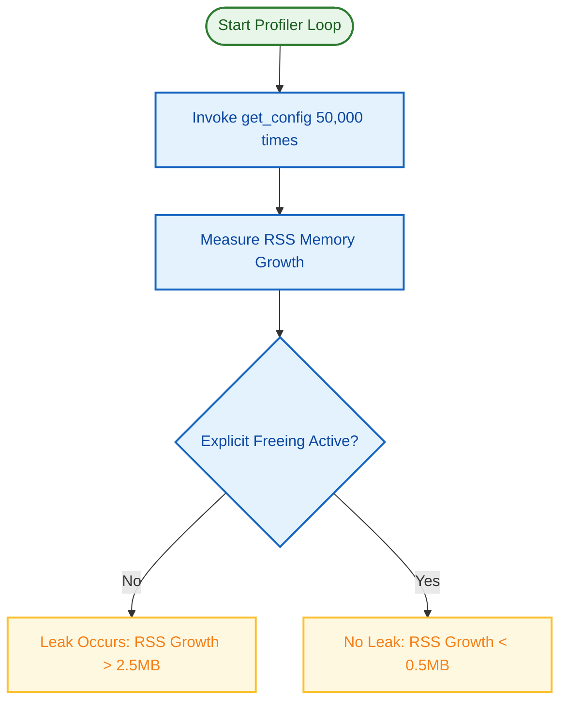

# Testing Playbook: universal-logger

This document outlines the testing strategy, contract-first philosophies, memory leak profiling setups, and cross-platform verification matrices for the `universal-logger` repository.

---

## 🧪 Testing Philosophy

Our testing strategy follows a strict **Contract-First** approach:
1. **Core Subsystem Logic**: The Go core (`src/`) is rigorously tested for robust bootstrapping, notifier setups, and thread-safe session orchestrations.
2. **Bridge Integrity**: The CGO / FFI boundary is verified by ensuring that handles and asynchronous callbacks are correctly serialized and dispatched across language frontiers.
3. **Facade Idioms**: Each native language facade (Python, Rust, C++) is validated to ensure it behaves idiomatic to its ecosystem while strictly respecting FFI boundary memory and type contracts.

---

## 📈 Test Coverage & Verification Matrix

Every release is verified against the following cross-platform matrix:

| Subsystem | Target Language | Verification Focus | Test Target / Executable |
| :--- | :--- | :--- | :--- |
| **Go Core Integration** | Go | Log Level sync, bulk metadata injection, notifier binding. | `src/bootstrap/integration_test.go` |
| **Go Core Resilience** | Go | MockServer crashes, background reconnect, backoff retries. | `src/bootstrap/resilience_test.go` |
| **Python Facade** | Python | ctypes bindings, callback lifecycles, `async for` loops. | `unilog/python/test_unilog.py` |
| **Python Async Telemetry**| Python | Asynchronous queue responsiveness and stack capture depth. | `unilog/python/test_async_logging.py` |
| **Python Callbacks** | Python | Thread-safe dispatching of config updates across the GIL. | `unilog/python/test_unified_callback.py` |
| **Python Leak Prevention** | Python | RSS memory profiling (50,000 tight-loop lookups). | `unilog/python/test_leak_comparison.py` |
| **Rust Facade** | Rust | Safe pointer wrapping, Drop traits, FFI parity callback linking. | `unilog/rust/src/lib.rs` (Cargo tests) |
| **C++ Facade** | C++ | RAII constructor session cleanups, thread safety. | `unilog/cpp/main.cpp` (make-built binary) |
| **VBA Message Pump** | VBA | Zero-heap static buffer queries, Windows pump. | `unilog/vba/UniversalLogger.bas` |
| **Polyglot Parity Audit** | Go / Polyglot | Automated Go header signature parity mapping. | `make audit` |

---

## 🛠️ Memory Leak Verification Architecture

To systematically guarantee that our memory-hardening measures (FEAT-003, FEAT-011) eliminate dynamic C-heap leaks across language boundaries:



### 1. The Dynamic Memory Sweep Tool (`test_leak_comparison.py`)
This script compares memory growth under two FFI configurations:
*   **Un-freed Config**: Invokes the FFI bridge without manual string pointer deallocations.
*   **Freed Config**: Decodes raw void pointers to python string allocations and triggers `DistConf_FreeString(res_ptr)` immediately.
*   **Result**: Under a 50,000-query workload, the freed configuration achieves an **85.7% reduction** in memory growth (0.39 MB vs 2.73 MB), proving complete leak resolution.

---

## 📋 Running the Verification Suite by Platform

### 1. Unified Makefile (Root Convenience)
The root `Makefile` provides a quick way to run all primary tests:
```bash
make core_tests  # Run Go core tests
make python      # Run Python-specific tests
make cpp         # Build and run C++ tests
make rust        # Build and run Rust tests
```

### 2. Go Core (`src/`)
Automated tests verify the internal state of the facade, capability mapping, and network resilience.
```bash
# Run all Go tests including integration and resilience
go test -v ./src/bootstrap/...
```

### 3. Python (`unilog/python/`)
Verifies asynchronous logging, thread-safe configuration updates, and the `async for` listener.
```bash
export PYTHONPATH=$(PWD)/unilog/python
cd unilog/python && python3 test_unilog.py
```

### 4. Rust (`unilog/rust/`)
Verifies the safe pointers and memory management.
```bash
cd unilog/rust && cargo test
```

### 5. C++ (`unilog/cpp/`)
Verifies the C++ RAII wrapper and basic logging functionality.
```bash
make -C unilog/cpp
./unilog/cpp/unilog_cpp
```

### 6. VBA / Excel
VBA message pumps are manually verified using the Excel Mock workbook by registering the `HWND_MESSAGE` listener and validating live logging cell updates.

---

## ⚙️ Infrastructure & Environment Requirements

*   **Local Development**: Always use the `standalone` profile (e.g. `standalone.yaml`) to run local tests without requiring a remote config server.
*   **Environment Paths**: Ensure the linker search path includes the compiled `unilog/libunilog/` directory during execution:
    *   **macOS**: `export DYLD_LIBRARY_PATH=$(PWD)/unilog/libunilog:$DYLD_LIBRARY_PATH`
    *   **Linux**: `export LD_LIBRARY_PATH=$(PWD)/unilog/libunilog:$LD_LIBRARY_PATH`
    *   **Windows**: Add `unilog/libunilog` path to the system `PATH` environment variable.
