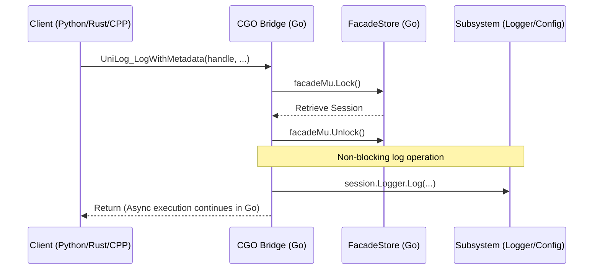

# Architecture: Go Core and CGO Bridge

This document explains the internal design of the Go core and the FFI (Foreign Function Interface) layer of the Universal Logger.

## The Bridge Pattern

The project uses a **Handle-Based Lifecycle** to manage long-lived Go objects from other languages (Python, Rust, C++).

### 1. Facade Store
All logger instances are stored in a thread-safe global map:

```go
// From cgo_bridge/initialize.go
var (
    facadeMu    sync.Mutex
    facadeStore = make(map[uintptr]*FacadeSession)
    facadeId    uintptr = 1
)
```

### 2. Handle Management
- **Initalization**: `UniLog_Init` creates a `FacadeSession`, generates a unique `uintptr` handle, and stores it in the map.
- **Reference Passing**: The library returns this handle (an integer) to the calling language.
- **Cleanup**: `UniLog_Close(handle)` removes the session from the map, allowing Go's garbage collector to reclaim the memory once the session is finished.

## CGO Communication Flow

When a language facade calls a logging method, it passes the session handle:



### 2. The CGO Bridge (`src/cgo_bridge/`)
The Bridge serves as the "Universal Translator":
- **FFI Stability**: Exposes a stable C ABI (Application Binary Interface).
- **Thread-Safe Unified Dispatcher**: Uses a "Platform-Aware" dispatcher (`dispatchConfigurationUpdate`) to route updates to either standard C-callbacks (Python/Rust/CPP) or the Windows Message Pump (VBA).
- **Callback Dispatching**: Handles the transition from Go goroutines to language-specific threads (e.g., acquiring the Python GIL) or posting asynchronous Windows messages.
- **String/Memory Safety**: Manages memory allocation/deallocation across the boundary (using `C.CString` and `C.free`).

## Data Flow: Configuration Updates

1. **Go Core**: Detects a remote configuration change.
2. **CGO Bridge**: Serializes the update to JSON and invokes the Unified Dispatcher.
3. **Unified Dispatcher**: 
   - **For Python/Rust/CPP**: Triggers the C function pointer registered by the client.
   - **For VBA**: Calls `PostMessageA` to the registered `HWND`.
4. **Client Reception**:
   - **Python**: Receives the callback in a background thread, pushes to an `asyncio.Queue`.
   - **VBA**: Receives the Windows message on the main thread and triggers `UniLog_WindowProc`.

## Data Translation and Memory Safety

Go and C have different memory models. The bridge ensures safe translation:
- **Strings**: C-strings (`*C.char`) are converted to Go-strings using `C.GoString` (copying the data).
- **Callbacks**: Function pointers from clients are stored as `C.config_update_cb` and called from background Go-threads.
- **JSON Serialization**: Configuration updates are serialized to JSON before being passed back to the client to avoid complex structure mapping across the FFI boundary.

## Concurrency and Performance

The Go core leverages Go's built-in concurrency. While the `facadeStore` uses a mutex for handle lookups, the actual logging and configuration operations occur asynchronously in background goroutines, ensuring that the client language is never blocked by I/O.
