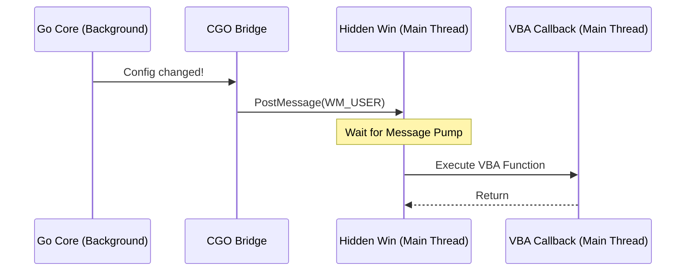

# Architecture: VBA / Excel Integration

This document explains the planned architectural design for the VBA facade of the Universal Logger.

## The Single-Threaded Constraints of VBA

VBA (Visual Basic for Applications) is fundamentally single-threaded and runs within the main UI thread of the host application (Excel, Access, etc.). This presents a challenge for receiving asynchronous configuration updates from the multi-threaded Go core.

## Core Implementation: Windows Message-Based Proxy

To safely bridge Go-side background callbacks into the single-threaded VBA context, we utilize a **Windows Message-Based Proxy**.

### 1. Hidden Proxy Window
When `StartConfigWatcher` is called in VBA, it creates a hidden window (`HWND`) using `HWND_MESSAGE`. This window is invisible and has no graphical presence.

### 2. Message Dispatching
When a configuration update occurs:
1.  **Go Thread**: The Go background goroutine triggers the `dispatchConfigurationUpdate` handler.
2.  **CGO Bridge**: It uses `PostMessageA(hwnd, WM_USER_101, 0, (LPARAM)json_data)` to send a message to the hidden window.
3.  **VBA Context**: The hidden window's subclassed procedure (`UniLog_WindowProc`) receives the message on the **Main UI Thread** and safely processes the update.

## Handle and Pointer Management

- **`LongPtr`**: In VBA, all Go handles are stored as `LongPtr` (compatible with 32-bit and 64-bit Office).
- **Manual Cleanup**: Since VBA lacks robust "drop" or "destructor" logic for modules, the developer must explicitly call `UniLog_Close` before the workbook is closed to prevent orphaned Go sessions and memory leaks.

## Marshaling and String Safety

- **BSTR vs C-String**: VBA strings are `BSTR` (wide-character). The `UniversalLogger.bas` wrapper automatically marshals these to null-terminated UTF-8 C-strings expected by the Go core using `StrConv` or internal Windows APIs.
